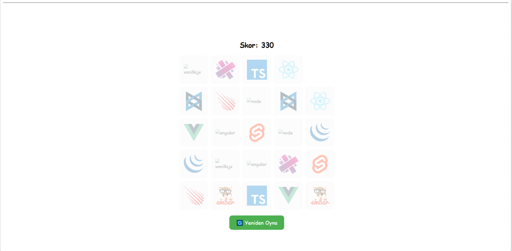
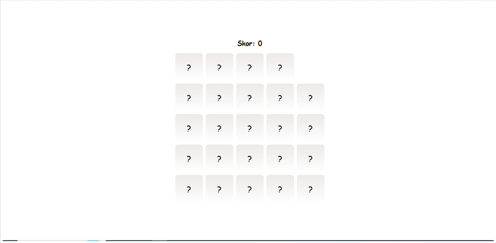

# 🧠 Card Game

Bu proje, popüler JavaScript framework ve kütüphanelerini kullanarak hazırlanmış basit ama eğlenceli bir kart eşleştirme oyunudur. Redux ile state yönetimi yapılmış, React ile bileşen bazlı bir yapı kurulmuştur.

 


## 🎮 Nasıl Oynanır?

- Her kart bir JavaScript framework'üne ait logoyu temsil eder.
- Aynı logoya sahip iki kartı art arda açarsan, eşleşme sağlanır ve skor kazanırsın.
- Yanlış eşleşmede skor kaybedersin.
- Tüm kartlar eşleştiğinde "Yeniden Oyna" butonu belirir.
- Oyun içerisinde bir adet "boş kart" (empty) vardır, bu eşleşmeye dahil değildir.

## 🚀 Başlangıç

Projeyi klonladıktan sonra aşağıdaki adımlarla çalıştırabilirsin:

```bash
git clone https://github.com/fatihcetin98/React-CardGame.git
cd vite-project
npm install
npm start
